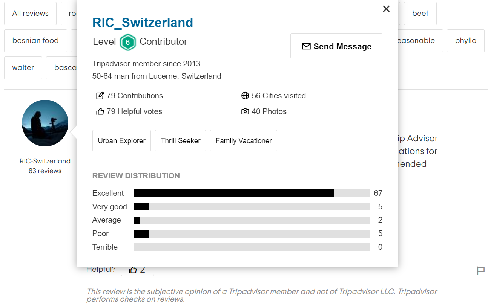

# General Information
An initial step of the project is to create a dataset to be part of a benchmark for the evaluation of Personalized Language Models (PLMs). The data were collected by scraping parts of the [TripAdvisor website](https://www.tripadvisor.com/), focusing on rich user profile (UP) data associated to natural language text contained in restaurant reviews as well as additional data.

The main dataset has different versions depending on the language (e.g., EN, FR, multi-lingual, etc.) and the (rounded down to the thousand) number of samples (e.g., 3K, 10K, etc.). A dataset is for example: `TA_final_dataset_EN_3K.csv`. 

Moreover, to contribute to the [LaMP benchmark](https://lamp-benchmark.github.io/index.html), we format the final dataset similarly to the other datasets part of the LaMP benchmark, yielding the LaMP_8 version of the dataset. The LaMP version consists of 6 subsets of the entire dataset. For example, for the 3K samples version: `LaMP_8_3K_train_input`, `LaMP_8_3K_train_output`, `LaMP_8_3K_val_input`, `LaMP_8_3K_val_output`, `LaMP_8_3K_test_input`, `LaMP_8_3K_test_output`. Note that `LaMP_8_3K_test_output` should not be made public.

The data can also be accessed through [this GDrive folder](https://drive.google.com/drive/folders/1ZAoYWg8iBICLYaEDwiABzkPS7pg_NfK_?usp=sharing). 

For the following sections, we continue to use the example of the `TA_final_dataset_EN_3K.csv` dataset.

## **Data collection**
The data were collected using Python and libraries such as Selenium to scrape parts of the TripAdvisor website. We focused on the Restaurants section of the website as it allowed to collect precious UP data that (apparently) cannot be found anywhere else on the website, surprisingly not even on a user's own profile. We make sure to collect users' profile links and additional data to be able to extend further the data collection if needed (e.g., by collecting more reviews per user, or different types of reviews per user).

The current data collection process, executed through several python scripts ([see Dataset creation section](#Dataset-creation)), is summarized as follows:

1. Collect restaurants from which we will collect data (e.g., reviews and associated users).
    * Create `TA_cities.txt`, a list of (top) cities to be scraped on TripAdvisor
    * Go to the main TripAdvisor webpage
    * Iterate over the list of cities and:
        + input the city entry to the TripAdvisor Restaurants search bar
        + go to the city's (top) restaurants
        + save the (top) restaurants' urls (~30) on the webpage in the file `TA_restaurants_urls.csv`
2.  Collect review and user data for the restaurants stored in the `TA_restaurants_urls.csv` file.
    * Iterate over the list of restaurants and:
        * select the language of the reviews (e.g., English, French, etc.)
        * iterate over the restaurant pages for restaurants that were yet not scraped in the selected language and:
            + collect the review and user data on the page if the UP meets a certain [criterion](./TripAdvisor/tripadvisor_scraping.py#:~:text=def%20define_collection_condition)
            * save the collected data/samples in the `TA_data_EN.csv` file
        + update the `TA_restaurants_urls.csv` by marking the scraped restaurant with the language for which we scraped reviews (e.g., "en" for English)

The [criterion](./TripAdvisor/tripadvisor_scraping.py#:~:text=def%20start_scraping) is important as it constitutes the basis of the samples collection. It was made relatively loose in order to give some margin to what would be the final dataset (e.g., when getting rid of samples with NaN values, less features but more samples, or more features but less samples). In the "raw" (i.e., before cleaning and preparation) dataset created, the UPs are at least containing: (age range, sex) OR (location, user_tags). However, many samples are a combination of those and all have additional features/information (e.g., number of cities visited, etc.).

### **Further collection details**
The current data were collected using a list of 50 top cities, around 30 top restaurants per city, and maximum 30 pages per restaurant. There is a maximum of 15 reviews per page.  

For one scraping instance, we have one sample processed (and potentially collected) every ~4s (3-5 seconds). 
Moreover, on average, around 1 out of 20 samples is collected (as it meets the current collection criterion).
Hence, on average with a margin for error, one sample is collected every ~100s. 
Therefore, to obtain 10k samples, the program needs to run for ~10^6 seconds. This means that ~278h / ~12 days are needed to collect 10k samples (given the current collection criterion).

Considering that we go over 20 pages of a restaurant on average (given that the hyper-parameter of number_of_pages_to_scrape_per_restaurant is set to 30), 
and that there are 15 reviews (samples) per page, we have ~(15*20)/20 = 15 samples collected per restaurant. Therefore, ~666 restaurants are needed to obtain 10k samples, which is achieved using around 20 cities. 

#### **Notes**
- After collecting those samples forming a "raw" dataset, the dataset will have to be cleaned.
- Over 10k reviews, there are less than a few hundreds of reviews for which the "More" button to expand a text review was not clicked due to website scraping instability. 
- For similar reasons, there are also a few duplicates from time to time, hence the dataset cleaning process at the end of scraping.
- There could be some other languages that were not properly filtered by TripAdvisor.

Below, we preview parts of what is seen during a scraping run to collect the data. 
| image screenshot 	| description 	|
|:---:	|:---:	|
| 	| Example of where the review data are obtained during scraping for a restaurant and review/user 	|
| 	| Example of where the user data are obtained during scraping for a restaurant and review/user  	|


## **Dataset creation**
The main dataset creation consists in running the three following scripts.

1. The file

```
python ./DataScraping/TripAdvisor/tripadvisor_save_restaurants_urls.py
```
, which collects restaurants to scrape and saves them in a the file `TA_restaurants_urls.csv`.

2. The file

```
python ./DataScraping/TripAdvisor/tripadvisor_scraping.py
```
, which is the main file to run to collect data/samples and can be run with the arguments
| parameter 	| description 	|
|---	|---	|
| --language 	| sets the language of the reviews 	|
| --nb_pages 	| sets the number of pages to scrape per restaurant 	|
| --resume_restaurant_url_index 	| sets the index in the file `TA_restaurants_urls.csv` at which the scraping should start/resume 	|

Once an error/exception occurs during a scraping run, a new scraping run is launched through [this function](./TripAdvisor/tripadvisor_scraping.py#:~:text=def%start_scraping) of the file `tripadvisor_scraping.py`. The scraping can be interrupted anytime, and it will be resumed from the restaurant at which it got interrupted if no sample got collected for it, or the next restaurant in the file if at least one sample got collected.


3. The file

```
python ./DataScraping/TripAdvisor/dataset_preparation.py
```
is used to clean and prepare the final dataset, and can be run with the argument
| parameter 	| description 	|
|---	|---	|
| --language 	| refers to the language of the dataset we are preparing 	|


## **Data format and statistics**
### **Format**
The file format is CSV tab separated or XML.

The final dataset contains the following features/columns:
																		

| feature/column 	| description 	|
|---	|---	|
|   user_id_link	|   TripAdvisor url to the profile of the user	(unique!)|
|   user_id	|   TripAdvisor unique user id (not unique!)	|
|   user_name	|   TripAdvisor user name (not unique)	|
|   user_ta_level	|   TripAdvisor level of contribution	|
|   user_age_range	|   age range (e.g., 35-49) of the user	|
|   user_sex	|   sex of the user (i.e., man or woman)	|
|   user_location	|   user location	|
|   user_nb_contributions	|   number of contributions made by the user	|
|   user_nb_cities_visited	|   number of cities visited by the user	|
|   user_nb_helpful_votes	|   number of helpful (as per TripdAdvisor) votes made by the user	|
|   user_nb_photos	|   number of photos posted by the user	|
|   user_tags	|   some tags describing the user (e.g., History Buff, Foodie, etc.)	|
|   restaurant_reviewed_url	|   TripAdvisor url of the restaurant from which the sample was collected	|
|   review_date	|   date at which the review was posted by the user	|
|   review_city	|   city in which the restaurant is located	|
|   review_lang	|   language of the review	|
|   review_rating	|   rating associated to the review given by the user	|
|   review_title	|   title of the review	|
|   review	|   review text	|


There is no NaN value in the final dataset (e.g., `TA_final_dataset_EN_3K.csv`), as the samples with at least one NaN value have been removed. 

### **Statistics**
One can run the script stats.py as
```
python ./TripAdvisor/stats.py
```
in order to compute some statistics for a given dataset.

| parameter 	| description 	|
|---	|---	|
| --dataset_version 	| specifies the version (e.g., EN_6K) of the dataset 	|

Alternatively, one can use [this notebook](./TripAdvisor/stats.ipynb) (the stats for the EN_3K version of the dataset is already displayed).

## **LaMP benchmark dataset: LaMP_8**
The LaMP version of the dataset can be obtained by running the script
```
python ./DataScraping/TripAdvisor/dataset_to_lamp.py
```
, for which the following arguments can be used
| parameter 	 | description 	|
|---	|---	|
| --output_column 	| the output/target feature/variable/column (e.g., ``review_rating``)	|
| --language 	| language of the samples (e.g., en, fr, pt, es, it, de, zhCN, etc.) 	|
| --nb_k_samples 	| rounded down number of samples in thousands (e.g., 3 for 3K samples, 10 for 10K samples, etc.) being the number of samples in an existing final dataset 	|
| --lamp_benchmark_index 	| the index of the LaMP benchmark dataset being created/formatted (e.g., 8 for LaMP_8, etc.) 	|

This results in 6 datasets (3 (input, output) pairs of subsets of the original final dataset): a training set, a validation and a test set, each separated into the input data and output data.

### **General Format**
The file format is JSON.

**For a train/val/test input dataset, we have samples with the following fields:**
| field  | description 	|
|---	|---	|
| id 	| id of the sample formatted with the following convention. First digit is the LaMP dataset index from 0. Second digit is 0 for train, 1 for validation, 1 for test. Next digits are the sample index within this dataset	|
| input 	| the input fed to the prediction model; typically the review data and UP data wrapped in a template prompt	|
| review_data 	| dictionary that contains the fields ``restaurant_reviewed_url``, ``review_date``, ``review_city``, ``review_lang``, ``review_title``, ``review``|
| profile 	| dictionary that contains the ``user_data`` and ``history`` fields	|

Within the field profile:
| field  | description 	|
|---	|---	|
|user_data 	| dictionary that contains the fields ``user_id_link``, ``user_id``, ``user_name``, ``user_ta_level``, ``user_age_range``, ``user_sex``, ``user_location``, ``user_nb_contributions``, ``user_nb_cities_visited``, ``user_nb_helpful_votes``, ``user_nb_photos``, ``user_tags``	|
| history 	| list containing data of other samples (empty list of none) associated with the same user, but only with the fields ``id``, ``input``, ``output``; note that this ``input`` field is slightly different than the ``input`` field in the current sample|

Within the field ``input`` of the field ``history``:
| field  | description 	|
|---	|---	|
| input 	| contains the actual model ``input`` and the ``review_data``|
| review_data 	| as described previously|

Within the field ``output`` of the field ``history``:
| field  | description 	|
|---	|---	|
| review_rating 	| value of the target output; here ``review_rating`` is the target output but it could be a different one|

**For a train/val/test output dataset:**
| field  | description 	|
|---	|---	|
| task 	| the name of the LaMP task	|
| golds 	| list containing the samples	|
| id 	| id of the sample formatted with the following convention. First digit is the LaMP dataset index from 0. Second digit is 0 for train, 1 for validation, 1 for test. Next digits are the sample index within this dataset  	|
| review_rating 	| value of the target output; here ``review_rating`` is the target output but it could be a different one	|


For now, we do not do perform prompt engineering to find a suitable prompt template to wrap the input data.


#### **For TA_final_dataset_EN_3K.csv to its LaMP version**
The train input/output dataset contains 2472 samples.


The validation input/output dataset contains 309 samples.


The test input/output dataset contains 310 samples.


Note that we can have many different "tasks" (input, profile, output) such as predicting age or sex or location from all the other information. We can specify it through the command line when running the python script. The default target/output variable/column is ``review_rating``.


# Questions/Remarks
- Not sure about my definition of the input data above in the LaMP dataset section.
- How to define a suitable template prompt to wrap the input data as per the other LaMP benchmark datasets?
- I still have to correct a few country names in the datasets. I will be able to do this easily once I will have gather more samples.
- We could collect user bios (although rarely available and usually short) later since we have the urls to the users' profiles.

# Notes
- The collected data are for research purpose only. 
- It is recommended to use a VPN or proxies while scraping (at a reasonable rate) in order to avoid getting IP banned.
- In order to run the above scripts, some extensions have to be setup and present in the Scraping/ folder at chromedriver_win32/, this is the case for the browser driver (e.g., chromedriver.exe), or the code line using such extension has to be removed. An extension such as istilldontcareaboutcookies-chrome-1.1.1_0.crx is not necessary but recommended.   
- The implicit/explicit waiting times can be changed directly in the code as suits the user.

